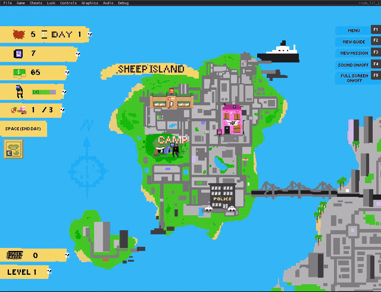
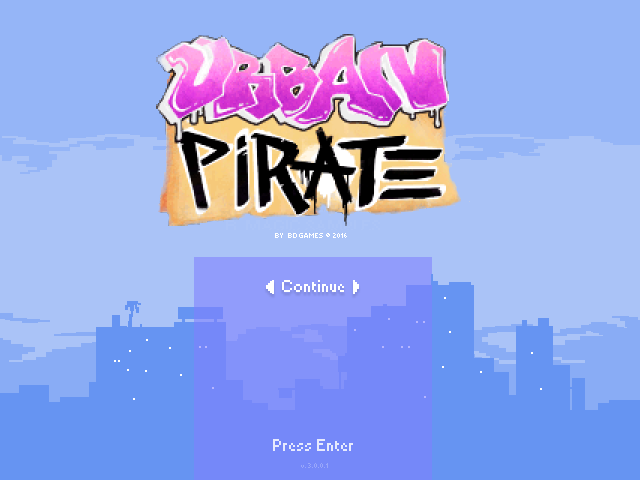
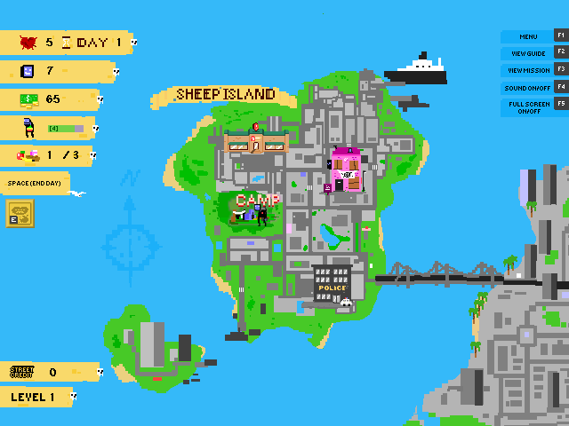
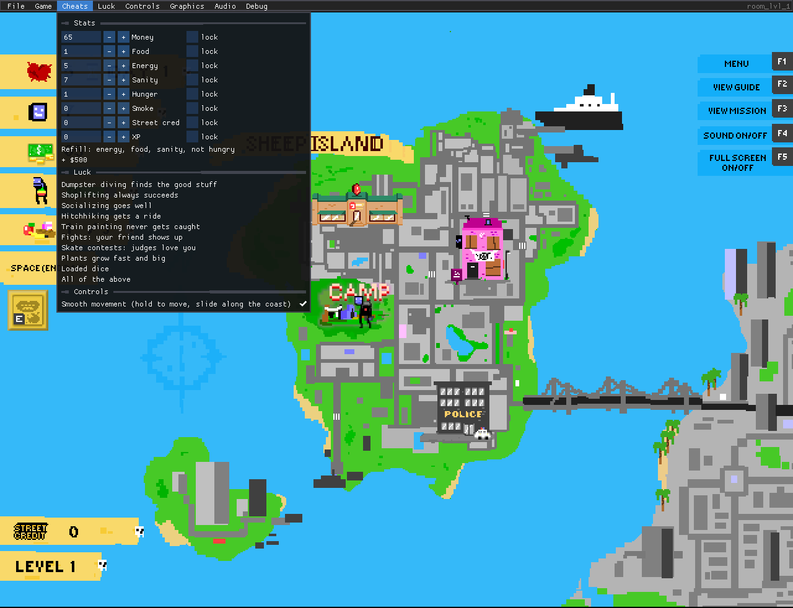

# Urban Pirate: Static Recompilation



A native build of **Urban Pirate** (BABY DUKA & BD Games, 2016, v3.0.0.1). The
game's GameMaker bytecode is lifted to C and compiled into a new Windows
program, with a dev/cheat menu docked above the game. YoYo's runner isn't
used, and nothing interprets bytecode at run time.

Built on the [gmrecomp](https://github.com/sp00nznet/gmrecomp) toolkit, a
sibling of [pcrecomp](https://github.com/sp00nznet/pcrecomp) that follows the
same house style for recompilation projects.

**Generated source is not distributed.** You supply your own copy of the game
(Steam). The recompiler runs on your machine and writes C into a gitignored
folder. No game data is in this repository.

## Status

**v0.1.0, alpha. It plays:** intro, title menu, new game, level 1 on Sheep
Island, the game's own save and Continue, music and sound.

| Area | State |
|---|---|
| Lift | 1691/1691 code entries, 46/46 built-in functions |
| Intro, title menu, level menu | Working |
| Levels (map, actions, days, stats) | Working through level 1 in headless runs; later levels not played through yet |
| Game's own save / Continue | Working (our own format; saves from the original game don't carry over) |
| Sound and music | Working in play (headless runs use a silent audio driver) |
| Dev menu: savestates, speed, cheats, luck, controls | Working |
| Steam achievements | Logged only |

Smoke test (`tools\smoke.ps1`): **2/2 routes pass**. New game reaches
`room_lvl_1`, and Continue loads the save.

## Screenshots

| | |
|---|---|
|  |  |
| Title menu, recompiled | Level 1, Sheep Island |
|  |  |
| Cheats: stats with locks, luck presets, controls | Luck: the sites the presets forced |

## What's added on top

The game runs as it shipped, and everything else is in the menu bar above it:

| Menu | What it does |
|---|---|
| **Cheats** | Edit money, food, energy, sanity, hunger, smoke, street cred and XP, or lock any of them. Refill everything, +$500. |
| **Cheats > Luck** | Dumpster diving finds the good stuff, shoplifting always succeeds, socializing goes well, hitchhiking gets a ride, train painting never gets caught, your friend shows up to fights, skate judges love you, plants grow fast and big, loaded dice. |
| **Cheats > Controls** | Smooth movement (on by default): hold the arrows to move, go diagonal, slide along the coast. |
| **Luck** | Every one of the game's 223 random picks, each labelled with its outcome and forceable. |
| **Controls** | Extra keys for any game key, and gamepad support (left stick or d-pad moves, A = Enter, X = Space...). |
| **File / Game** | 10 savestate slots (F6/F7), pause (F8), frame step (F9), speed 0.25x-8x, hold Tab for 4x, go to any room. |
| **Debug** | Every global and every instance, editable. Collision boxes. |

What each cheat changes, and why the stock controls feel bad:
[docs/cheats.md](docs/cheats.md).

## Getting Started

### Quick start

1. Install Urban Pirate from Steam.
2. Download this repository (Code > Download ZIP) and unzip it anywhere.
3. Double-click **`Setup.cmd`**. It checks for Python, the Visual Studio C++
   tools, vcpkg and its libraries, and the gmrecomp toolkit. For anything
   missing, it says what and how big and asks before installing. It finds the
   game through Steam, or asks for its folder.
4. Double-click **`Play Urban Pirate.cmd`**.

If a step fails, Setup says what to do in one sentence and keeps the details
in `setup.log`. Running it again resumes where it stopped.

### Step by step

Prerequisites: Python 3.10+, Visual Studio 2022 (any edition, or Build Tools)
with the C++ workload, git, and vcpkg at `C:\vcpkg`.

1. Libraries (about 10 minutes the first time):
   ```
   C:\vcpkg\vcpkg install sdl2 sdl2-image sdl2-mixer imgui --triplet x64-windows
   ```
2. The toolkit, next to this folder:
   ```
   git clone https://github.com/sp00nznet/gmrecomp ..\gmrecomp
   ```
3. Recompile and build:
   ```
   powershell -ExecutionPolicy Bypass -File build.ps1
   ```
   Expected output:
   ```
   game:    C:\Program Files (x86)\Steam\steamapps\common\Urban Pirate
   toolkit: ...\gmrecomp
   [1/2] Recompiling data.win -> generated\ ...
   lifted 1691/1691 code entries, 46 functions used, 223 choose() sites
   [2/2] Building build\UrbanPirate.exe ...
   built ...\build\UrbanPirate.exe
   done. Run 'Play Urban Pirate.cmd'.
   ```
   If the game isn't in a Steam library, add `-GameDir "D:\path\to\Urban Pirate"`.
4. Run `Play Urban Pirate.cmd`.

Trip-ups: `python` opening the Microsoft Store means the Store alias is on
(the scripts use `py` when it exists). Libraries built for the wrong triplet
don't link, so it must be `x64-windows`. A freshly installed Python needs a
new terminal window before it's on `PATH`.

## Usage

```
build\UrbanPirate.exe --game "<game folder>"                     play
build\UrbanPirate.exe --game "<game folder>" --headless --frames 900 --record run.mp4
powershell -File tools\smoke.ps1                                 headless route checks
```

In-game keys are the originals: arrows, Enter, Space (end day), E (eat),
F1-F5. Added: F6/F7 savestate, F8 pause, F9 frame step, Tab turbo,
` globals. Your saves and settings are in `%LOCALAPPDATA%\gmrecomp\Urban_Pirate\`.

## Building from source

`build.ps1` runs the toolkit's recompiler into `generated\`, then its
`tools\build.ps1` with this repo's `profile\` (the cheats). `profile/profile_up.cpp`
is the only game-specific code. See the toolkit's
[docs/building.md](https://github.com/sp00nznet/gmrecomp/blob/main/docs/building.md).

## License

MIT for this repository's code, see [LICENSE](LICENSE). Urban Pirate itself
belongs to BABY DUKA & BD Games, and none of it is here. Buy it on Steam.
